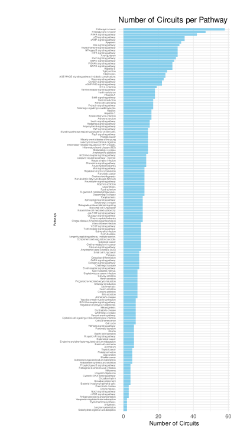

# Metabopathia

**Metabopathia** is a computational method designed to model signal transduction through cellular pathways by integrating transcriptomic and metabolic data. It builds on the Canonical Circuit Activity Analysis ([CCAA](https://pubmed.ncbi.nlm.nih.gov/28042959/)), an iterative algorithm that computes signal intensities through networks composed of nodes representing proteins, metabolites, and cellular functions or phenotypes. These networks include both signaling and metabolic pathways, currently utilizing pathway maps from databases like KEGG.
## Table of Contents  
- [Key Concepts](#KeyConcepts)    
- [Metabopathia approach](#MetabopathiaAproach)
- [Quick start](#QuickStart)
    - [Setting up the environment](#SettingUptheEnvironment)
    - [Getting started](#GettingStarted)
- [Breast cancer case study](#BRCACaseStudy)
    - [Overview](#Overview)
    - Input data:
        - [Data preprocessing story: From TCGA repository to Metabopathia input dataset](#preprocessing)
        - [Selected Signaling and metabolic pathways](#pathways)
    - [Modeling approach](#Modeling)
    - [Results and discussion](#ResultsDiscussion) 
- [Future enhancements](#FutureEnhancements)

  
<a name="KeyConcepts"> </a>   
    
## Key Concepts

- **Biological Network**: A representation of biological entities (such as genes, proteins, and metabolites) and their interactions within a living system. These networks capture how molecules interact to carry out cellular functions.

- **Pathways**: A sequence of molecular events or interactions that lead to a specific cellular outcome. Pathways can involve signaling cascades (signaling pathways) or metabolic processes (metabolic pathways), describing how cells respond to signals or perform biochemical reactions.

- **Nodes in Biological Pathways**: In a biological network, nodes represent molecular entities, such as genes, proteins, or metabolites. Each node is a key player in the pathway, contributing to the overall biological process or signal transduction.

- **Interactions in Biological Pathways**: The connections between nodes, known as edges, represent molecular interactions, such as activation, inhibition, or binding events. These interactions define how signals or molecular changes propagate through the network, leading to functional outcomes.
- diagrams maps pathway network : Here I have to be clear about different terminology 


<a name="MetabopathiaAproach"> </a>      

## Metabopathia aproach

The aim of Metabopathia is to offer a novel approach to multi-omics data integration for pathway activity analysis. It reduces the complexity of entire pathways by breaking them down into sub-pathways or circuits (segments that have only one final node, known as the effector). The activity of each individual node is then calculated depending on the type of molecular component involved in signal transduction. These components include proteins and metabolites, with gene expression levels and metabolite activity used as proxies for protein presence and metabolite concentration, respectively. Unlike enrichment-based methods, this algorithm distinguishes between activation and inhibition interactions when inferring signal propagation towards the effector. The final nodes, or effectors, are annotated with their corresponding cellular functions.

To summarize, the algorithm calculates signal intensities as they propagate through the network to effector nodes—the final protein nodes in each sub-pathway or circuit—annotated with specific cellular functions and phenotypic outcomes.

This mechanistic approach enables researchers to better understand the functional impact of gene expression and metabolite dynamics in biological systems, providing a more detailed and accurate representation of cellular signaling and metabolic interactions.

This repository contains the full implementation of Metabopathia, along with an example study using breast cancer data from The Cancer Genome Atlas (TCGA). Metabopathia is currently under development as a web server, accessible [here](http://hipathia.babelomics.org/metabopathia_dev/).

<a name="QuickStart"> </a>       

## Quick Start

<a name="SettingUptheEnvironment"> </a>        

### Setting up the Environment

Before running the code, follow these steps to set up the environment:

1. **Install R version** 4.3.1 on your system (or a newer version).

2.  **[Optional for Linux users]**:
   If you have multiple R versions installed on your machine, open a terminal and set the `RSTUDIO_WHICH_R` environment variable to specify the R version for RStudio. Use the following command:

    ```bash
    export RSTUDIO_WHICH_R=/opt/R/4.3.1/bin/R
    ```
3. **Install required Dependencies**:
The required dependencies are:  ```"BiocManager", "hipathia", "igraph", "SummarizedExperiment", "Matrix", "preprocessCore", "KEGGREST", "optparse"```. You can either install these manually or clone the repository and run the `00_prep_env.R` script to install all the required dependencies and packages.
      
4. **R Session Information**: For reproducibility and troubleshooting, here is the R session information used in this project:

```R
R version 4.3.1 (2023-06-16)
Platform: x86_64-pc-linux-gnu (64-bit)
Running under: Ubuntu 20.04.6 LTS

Matrix products: default
BLAS:   /opt/R/4.3.1/lib/R/lib/libRblas.so 
LAPACK: /opt/R/4.3.1/lib/R/lib/libRlapack.so;  LAPACK version 3.11.0

locale:
 [1] LC_CTYPE=en_US.UTF-8       LC_NUMERIC=C               LC_TIME=es_ES.UTF-8        LC_COLLATE=en_US.UTF-8    
 [5] LC_MONETARY=es_ES.UTF-8    LC_MESSAGES=en_US.UTF-8    LC_PAPER=es_ES.UTF-8       LC_NAME=C                 
 [9] LC_ADDRESS=C               LC_TELEPHONE=C             LC_MEASUREMENT=es_ES.UTF-8 LC_IDENTIFICATION=C       

time zone: Europe/Madrid
tzcode source: system (glibc)

attached base packages:
[1] stats     graphics  grDevices utils     datasets  methods   base     

loaded via a namespace (and not attached):
  [1] tidyselect_1.2.1              dplyr_1.1.4                   blob_1.2.4                   
  [4] filelock_1.0.3                Biostrings_2.68.1             bitops_1.0-7                 
  [7] fastmap_1.1.1                 RCurl_1.98-1.14               BiocFileCache_2.8.0          
 [10] promises_1.3.0                digest_0.6.35                 mime_0.12                    
 [13] lifecycle_1.0.4               KEGGREST_1.40.1               interactiveDisplayBase_1.38.0
 [16] RSQLite_2.3.6                 magrittr_2.0.3                compiler_4.3.1               
 [19] rlang_1.1.3                   tools_4.3.1                   igraph_2.0.3                 
 [22] utf8_1.2.4                    yaml_2.3.8                    ggsignif_0.6.4               
 [25] S4Arrays_1.0.6                htmlwidgets_1.6.4             bit_4.0.5                    
 [28] curl_5.2.1                    DelayedArray_0.26.7           plyr_1.8.9                   
 [31] abind_1.4-5                   purrr_1.0.2                   BiocGenerics_0.46.0          
 [34] grid_4.3.1                    stats4_4.3.1                  preprocessCore_1.62.1        
 [37] fansi_1.0.6                   ggpubr_0.6.0                  xtable_1.8-4                 
 [40] colorspace_2.1-0              ggplot2_3.5.1                 scales_1.3.0                 
 [43] MultiAssayExperiment_1.26.0   SummarizedExperiment_1.30.2   cli_3.6.2                    
 [46] crayon_1.5.2                  generics_0.1.3                rstudioapi_0.16.0            
 [49] reshape2_1.4.4                httr_1.4.7                    visNetwork_2.1.2             
 [52] DBI_1.2.2                     cachem_1.0.8                  stringr_1.5.1                
 [55] zlibbioc_1.46.0               AnnotationDbi_1.62.2          BiocManager_1.30.23          
 [58] XVector_0.40.0                matrixStats_1.3.0             vctrs_0.6.5                  
 [61] Matrix_1.6-5                  carData_3.0-5                 jsonlite_1.8.8               
 [64] car_3.1-2                     IRanges_2.34.1                S4Vectors_0.38.2             
 [67] rstatix_0.7.2                 bit64_4.0.5                   hipathia_3.0.2               
 [70] tidyr_1.3.1                   servr_0.30                    glue_1.7.0                   
 [73] stringi_1.8.3                 gtable_0.3.5                  BiocVersion_3.17.1           
 [76] later_1.3.2                   GenomeInfoDb_1.36.4           GenomicRanges_1.52.1         
 [79] munsell_0.5.1                 tibble_3.2.1                  pillar_1.9.0                 
 [82] rappdirs_0.3.3                htmltools_0.5.8.1             GenomeInfoDbData_1.2.10      
 [85] R6_2.5.1                      dbplyr_2.3.4                  shiny_1.8.1.1                
 [88] Biobase_2.60.0                lattice_0.22-6                MetBrewer_0.2.0              
 [91] AnnotationHub_3.8.0           backports_1.4.1               png_0.1-8                    
 [94] broom_1.0.5                   memoise_2.0.1                 httpuv_1.6.15                
 [97] Rcpp_1.0.12                   xfun_0.43                     MatrixGenerics_1.12.3        
[100] pkgconfig_2.0.3
```
### <a name="GettingStarted"> </a> Getting Started

Follow these steps to launch the case study from the command line:

1. **Clone the Repository:**
   ```bash
   git clone https://github.com/kinzaR/metabopathia.git
   cd metabopathia 
   ```
2. **Install dependencies:**
   Execute the `00_prep_env.R` file to install the required dependencies and packages. Use the following command in your R environment:
    ```R
    source("00_prep_env.R")
    ```
   This ensures that RStudio uses the correct R version when launching.
4. **Run the Breast cancer case study**    
This command will load a set of breast cancer data that was previously preprocessed. [See the Jupyter notebook for more details on how the preprocessing is done](data_examples/TCGA/TCGA-BRCA_RNA-seq_Data_Analysis_Report_v1.1.1/TCGA-BRCA_RNA-seq_Data_Analysis_Report_v1.1.1.ipynb). After loading the TCGA preprocessed data, the **Metabopathia** analysis is performed. A final report will be generated and launched from the server, which can be visualized through your web browser:

    ```R
    ./01_main.R --example
    ```
    Once the analysis is complete, you will see a status message like the following in the terminal:
    
    As shown in the message above, the pathways viewer is accessible at: http://127.0.0.1:4321. Additionally, a folder will be created with a suffix of `metabopathia[Number]`, containing figures and tables generated by this example.
    >**Note:** The number appended to the `metabopathia[Number]` folder ensures previous analyses are not overwritten. It increments automatically, detecting existing folders with the same name and creating a new one as needed.
    
    Further information is explained below in the [Breast cancer case study](#BRCACaseStudy)  section.
    
6. **Example Command**
For help: 
   ```bash
   ./01_main.R -h 
   ```
   or 
   ```bash
   Rscript 01_main.R -h 
   ```
4. **Parameters**
    ```bash
    $ ./01_main.R --help
    Usage: ./01_main.R [options]


    Options:
        -s SPE, --spe=SPE
            Species variable. Allowed choices: 'hsa', 'mmu', 'rno'. (default: hsa)

        -v, --verbose
            Enable verbose mode.

        -e EXP_FILE, --exp_file=EXP_FILE
            Path to the expression file.

        -m MET_FILE, --met_file=MET_FILE
            Path to the metabolomics concentration file.

        -t MET_TYPE, --met_type=MET_TYPE
            Allowed values: 
                  inferred: Infer production of metabolites from Metabolizer (doi: 10.1038/s41540-019-0087-2).
                  perturbations: Study perturbance in metabolite concentration.
                  concentration_matrix: Using metabolomics concentration matrix.

        -d DESIGN_FILE, --design_file=DESIGN_FILE
            Path to the design file.

        --group1=GROUP1
            Label of the first group.

        --group2=GROUP2
            Label of the second group to be compared (Reference condition).

        -p PATHWAYS_LIST, --pathways_list=PATHWAYS_LIST
            Vector of the IDs of the pathways to load. By default, all available pathways are loaded. Example: '04014,04015'.

        --paired
            Boolean, whether the samples to be compared are paired. If TRUE, function wilcoxsign_test from package coin is used. If FALSE, function wilcox.test from package stats is used.

        --decompose
            Boolean, whether to compute the values for the decomposed subpathways. By default, effector subpathways are computed.

        --design_type=DESIGN_TYPE
            Type of design. Allowed values: 'categorical' or 'continuous'. Default is 'categorical'.

        --adjust
            Boolean, whether to adjust the p.value with Benjamini-Hochberg FDR method. Default is TRUE.

        --conf.level=CONF.LEVEL
            Level of significance. By default 0.05.

        --difexp
            Boolean, whether to perform differential expression analysis.

        --GO.terms
            Boolean, whether to compute functional analysis with Gene Ontology terms.

        --uni.terms
            Boolean, whether to compute functional analysis with Uniprot keywords.

        --custom.terms=CUSTOM.TERMS
            Path to a file containing a data.frame with the custom annotation of the genes to the functions. First column are gene symbols, second column the functions.

        --analysis=ANALYSIS
            Type of analysis. Allowed values:'overlay','ORA', 'compare', 'predictor_test', 'predictor_train', 'variant_interpreter', 'drug_repurposing'. Default is 'compare'.


                          Differential Signaling 'compare': Provides an estimation of significant cell signaling activity changes across different conditions.

                          Predictor 'predictor': Allows you to train a prediction-test and test it with different data.

                          Variant Functional Interpretation 'variant_interpreter': Provides an estimation of the potential impact of genomic variation on cell signaling and cell functionality.

                          Drug Repurposing 'drug_repurposing': drug repurposing.

        --output_folder=OUTPUT_FOLDER
            Output folder path. Default is 'tmp'.

        --hipathia
            Enable calculation using HiPathia for result comparison between MetaboPathia and HiPathia.

        --example
            Load variables from the example config file (src/example1.R).

        --ready_mgi
            Load ready mgi pre-processed.

        -h, --help
            Show this help message and exit

    ```

      
<a name="BRCACaseStudy"> </a>        
## Breast cancer case study

<a name="Overview"> </a>         

### Overview        
The diagram below provides an overview of the workflow used in the breast cancer case study, detailing each key step in the analysis process:
        

<a name="Dataset"> </a>         

### Input data
#### RNA-seq data
For this case study, we are using breast cancer RNA-seq data from The Cancer Genome Atlas (TCGA). This dataset provides comprehensive genomic profiles of breast cancer. The original dataset had **1231 samples** and **60660 genes** (retrieved on June 27, 2024) (See Table 1). The raw data can be downloaded from the [TCGA data portal](https://portal.gdc.cancer.gov/) in the form of count matrices. (See [link](http://hipathia.babelomics.org/metabopathia_dev/reports/TCGA-BRCA_RNA-seq_Data_Analysis_Report_v1.1.1.html#3) for data acquisition commands and scripts)    

**Table 1:** Summary table;Number of samples and  participants per tissue types in the breast cancer dataset.
| Sample Types         | Number of Samples | Number of Participants |
|----------------------|------------------|-----------------------|
| Metastatic           | 7                | 7                     |
| Primary Tumor        | 1111             | 1095                  |
| Solid Tissue Normal   | 113              | 113                   |
| **Total**            | **1231**         | **1215**              |

<a name="preprocessing"> </a>      

##### Preprocessing Story: From TCGA Repository to Metabopathia Input Data

The preprocessing pipeline for this case study follows a series of steps aimed to prepare TCGA RNA-seq data for our downstream analysis with Metabopathia:

1. **Quality assessment via PCA and Hierarchical Clustering**: Principal Component Analysis ([PCA](https://doi.org/10.1038/s43586-022-00184-w)) and Hierarchical Clustering ([HC](10.21037/atm.2017.02.05)) are conducted to evaluate the quality of the dataset and detect any outliers or batch effects. This ensures that only clear and consistent RNA-seq data capturing the biological effect of interest (Tumor samples Vs Controls) are kept for further analysis.

2. **Low Count Removal**: In this analysis, filtering out lowly expressed genes has been adapted to our pathway activity analysis approach. Unlike differential expression analysis pipelines, which commonly remove lowly expressed genes, our mechanistic modeling approach requires the retention of all available data. Excluding these genes would lead to artificial imputation of missing values (e.g., using 0.5), which would not accurately represent the biological reality of low expression. By retaining lowly expressed genes, we ensure that the model reflects true biological conditions.     
   For this dataset , we identified a total of 28502 genes considered lowly expressed across all cancers using `filterByExpr` [fuction](https://rdrr.io/bioc/edgeR/man/filterByExpr.html) of [EdgeR package]( 10.1093/bioinformatics/btp616). 294 genes of them belong to our integrated pathways (See [supplimentary table](supplementary_files/brca_caseStudy/brca_hipathia_null_genes_v1.tsv)).    
   Finally, we **filtered out 28,208 of the 60,660 genes** that were considered lowly expressed between the two groups.        
4. **Gene Expression Normalization**: The data were normalized using the trimmed mean of M-values (TMM) method, which adjusts for differences in library sizes across samples. This normalization step is critical for ensuring accurate comparisons between gene expression levels across different samples.

5. **Log Transformation and Outlier Management**: After normalization, the data are log-transformed to stabilize variance. Additionally, truncation is applied at the 99th percentile to manage extreme values and minimize the impact of outliers on the analysis.

6. **Batch Effect Correction**: To address potential batch effects, the ComBat method is applied. This statistical approach helps to remove unwanted variability introduced by non-biological factors, ensuring that the final data input into Metabopathia accurately reflects the underlying biological signals.

7. **Final Quality Assessment**: A final quality assessment is performed using both PCA and hierarchical clustering to confirm that the data are clean and suitable for analysis.
<p float="center">
  
  
</p>

These preprocessing steps generate a clean and normalized dataset -**218 samples**- (109 from each group) ready for pathway activity analysis with Metabopathia.    

**For more information and reproducibility, check these links:**
- This folder on GitHub: [data_examples/TCGA/TCGA-BRCA_RNA-seq_Data_Analysis_Report_v1.1.1](data_examples/TCGA/TCGA-BRCA_RNA-seq_Data_Analysis_Report_v1.1.1) contains all generated figures and the Jupyter notebook exported as:
     -  [markdown](ata_examples/TCGA/TCGA-BRCA_RNA-seq_Data_Analysis_Report_v1.1.1/TCGA-BRCA_RNA-seq_Data_Analysis_Report_v1.1.1.md),
     -  [HTML](data_examples/TCGA/TCGA-BRCA_RNA-seq_Data_Analysis_Report_v1.1.1/TCGA-BRCA_RNA-seq_Data_Analysis_Report_v1.1.1.html),
     -  [notebook](data_examples/TCGA/TCGA-BRCA_RNA-seq_Data_Analysis_Report_v1.1.1/TCGA-BRCA_RNA-seq_Data_Analysis_Report_v1.1.1.ipynb).

- Additionally, it is available externally here:
    - Jupyter Colab: [TCGA-BRCA RNA-seq Data Analysis Report](https://colab.research.google.com/github/kinzaR/metabopathia/blob/dev/data_examples/TCGA/TCGA-BRCA_RNA-seq_Data_Analysis_Report_v1.1.1/TCGA-BRCA_RNA-seq_Data_Analysis_Report_v1.1.1.ipynb).
    - Published on the web through this link: [Metabopathia reports: TCGA-BRCA RNA-seq Data preprocessing](http://hipathia.babelomics.org/metabopathia_dev/reports/TCGA-BRCA_RNA-seq_Data_Analysis_Report_v1.1.1.html).

<a name="pathways"> </a>   

#### Selected Pathways
##### Signaling Pathways    
For the mechanistic modeling carried out with Metabopathia, a total of 146 KEGG signaling pathways were selected ([See table](supplementary_files/pathways_information.tsv)). These pathways were represented as activity flow maps. Each pathway was parsed into two files: a Simple Interaction File (SIF) for interactions between nodes, and an Attribute File (ATT) containing attributes for each node, such as labels, gene lists, and layout information. These files were then encapsulated into a meta-graph-info R object using the `mgi_from_sif()` function from the HiPathia R package.

The interactions from KEGG were categorized into activation and inhibition interactions, while unknown interactions were removed. Phenotypes from KEGG were not retrieved, and a functional annotation step was performed using Gene Ontology and UniProt keywords (previously done and explained in [Rian, Kinza et al. (2021)](https://doi.org/10.1016/j.csbj.2021.05.022)).

##### Metabolic pathways
A total of 48 metabolic pathways were downloaded from the KEGG PATHWAY database in KGML format ([See table](supplementary_files/module_paths_extended_info.tsv)). Each KEGG module consists of reaction nodes (representing one or more isoenzymes or enzymatic complexes) connected by edges that describe the sequence of reactions transforming simple metabolites into complex ones, or vice-versa. This process was previously explained and done by Çubuk et al. (2019) ([Çubuk et al., 2019](https://doi.org/10.1038/s41540-019-0087-2)).  

<a name="Modeling"> </a>         

### Modeling Platform
#### Data Scaling and Normalization
Metabopathia requires a preprocessed gene expression matrix, assuming the data has been normalized to correct for sequencing biases, including batch effects. The tool does not handle missing data, but for the BRCA dataset used in this analysis, no NA values were present.

The gene expression matrix must use Entrez IDs as row names, and the `hipathia::translate_data()` function was used to convert Ensembl IDs. Before calculating subpathway activation values, the expression data were scaled between 0 and 1.    

#### Pathway Decomposition    
##### Sub-pathways or Circuits
Pathways are often multifunctional, composed of different subpathways that can trigger very different or even opposite cell behaviors depending on the specific signal propagation. Assessing the activity of whole pathways limits our understanding of cellular functions, whereas focusing on subpathways, such as receptor(s)-to-effector circuits, allows for a more accurate description of cell activities and their relationship to specific phenotypic outcomes.([doi: 10.1093/bib/bby040](https://doi.org/10.1093/bib/bby040)).
>Note: The terms "sub-pathway" and "circuit" are used interchangeably.
  
We use the `hipathia::load_pathways` function to import the preselected pathways, setting the `species` parameter to `"hsa"` (Homo sapiens). A custom list of 146 signaling pathway IDs is provided, and this function returns a meta-graph-info R object containing both full pathways and a list of sub-pathways for each. You can find all the 1876 circuits per pathway in this table: [circuits of 146 pathways](supplementary_files/circuitsOf146_pathway.tsv). Additionally, the figure below shows the number of circuits per pathway:



###### Metabolite Annotation within Pathways
Before applying Metabopathia, an adaptation step is required to integrate metabolite information. This is achieved using the `add_metabolite_to_mgi` function, which enriches the signaling pathways by adding metabolites ids to the meta-graph-info R object. This ensures that Metabopathia accurately identifies metabolites and includes them in the estimation of propagated signaling cascades.    
You can find detailed information about the selected signaling pathways, including columns such as `path_id`, `name`, `class`, `description`, `compounds`, `shortName`, `numberOfNodes`, `numberOfMetabolites`, `annotatedMetabolite`, and `metaboliteList` in this table: [pathways_information.tsv](supplementary_files/pathways_information.tsv).

##### Metabolic modules
Metabolic modules provide a simplified yet comprehensive view of key metabolic activities by grouping essential biochemical reactions involved in metabolite production. Unlike entire pathways, modules focus on specific reaction chains, ensuring a more targeted analysis of metabolic transformations.
In this analysis, 96 metabolic modules derived from 48 KEGG pathways were included. Below is a summary of pathways and modules by KEGG classes:

| Class                                                | Number of Pathways | Number of Modules |
|------------------------------------------------------|--------------------|-------------------|
| Metabolism; Amino acid metabolism                    | 9                  | 20                |
| Metabolism; Carbohydrate metabolism                  | 9                  | 18                |
| Metabolism; Glycan biosynthesis and metabolism       | 9                  | 20                |
| Metabolism; Lipid metabolism                         | 10                 | 26                |
| Metabolism; Metabolism of cofactors and vitamins     | 3                  | 3                 |
| Metabolism; Metabolism of other amino acids          | 1                  | 1                 |
| Metabolism; Metabolism of terpenoids and polyketides | 1                  | 2                 |
| Metabolism; Nucleotide metabolism                    | 2                  | 7                 |
| NA                                                   | 4                  | 20                |
| **Total**                                            | **48**             | **117**           |

Twenty modules belong to multiple KEGG classes, for example M00741_C00091 belong to both Amino Acid and Carbohydrate Metabolism classes. These pathways are based on the 2016 KEGG version, and updating the pathways is recommended for future analyses. For more detailed information, including columns such as module, path_id, path_name, class, description, and compounds, refer to the [see supp table](supplementary_files/module_paths_extended_info.tsv). 

#### Node Scoring       
Each node in a pathway represents a molecular component, which can either be a protein or a metabolite. Nodes are classified into the following types:

- **Protein Family Nodes:** These nodes contain one or more proteins, representing different isoforms of the same protein or members of a gene family.
- **Complex Nodes:** These nodes consist of multiple proteins that form a molecular complex, requiring the interaction of several proteins to function together.
- **Metabolite Nodes:** Also called compounds, these nodes represent small molecules such as amino acids, lipids, nucleic acids, carbohydrates, and vitamins.

Since gene expression is used as a proxy for protein presence, and inferred metabolite activity serves as a proxy for metabolite concentration, Metabopathia computes a summarized score for each node, representing its overall value within the sub-pathway:    
- **Protein Families:**  
  In protein family nodes, the activity is driven by a single protein from the family. The node value is calculated as the 90th percentile of the expression values of the proteins in that family.      
- **Complexes:**  
  In complex nodes, multiple proteins are required for activity. The node value is determined by the lowest expression value (the limiting component) among the proteins forming the complex; this minimum expression is taken as the node value for this type.    
- **Metabolites:**
For metabolite nodes, Metabopathia integrates inferred metabolic activity using the Metabolizer approach. This method builds mechanistic models that link gene expression to metabolic activities within metabolic modules, estimating the production of specific metabolites. 

##### Metabolite Inference 
A total of **15 metabolites** were inferred using the `infer_met_from_metabolizer()` function from the Metabolizer package. The identified metabolites are `C00002, C00022, C00026, C00042, C00122, C00130, C00195, C00334, C00410, C00762, C00788, C01598, C01673, C01780, C02465`.
According to [MetaboAnalyst 5.0 platform ](https://www.metaboanalyst.ca/Secure/process/NameMapView.xhtml)  [\[Ref\]](https://doi.org/10.1093/nar/gkp356), the annotation of these inferred metabolites across HMDB, SMILES, and PubChem databases is:

| Query   |                Match               | HMDB         | PubChem| KEGG    | SMILES                                                                                                          |
|---------|------------------------------------|--------------|--------|---------|-----------------------------------------------------------------------------------------------------------------|
| C00002  | Adenosine triphosphate             | HMDB0000538  | 5957   | C00002  | NC1=NC=NC2=C1N=CN2[C@@H]1O[C@H](COP(O)(=O)OP(O)(=O)OP(O)(O)=O)[C@@H](O)[C@H]1O                                  |
| C00022  | Pyruvic acid                       | HMDB0000243  | 1060   | C00022  | CC(=O)C(O)=O                                                                                                    |
| C00026  | Oxoglutaric acid                   | HMDB0000208  | 51     | C00026  | OC(=O)CCC(=O)C(O)=O                                                                                             |
| C00042  | Succinic acid                      | HMDB0000254  | 1110   | C00042  | OC(=O)CCC(O)=O                                                                                                  |
| C00122  | Fumaric acid                       | HMDB0000134  | 444972 | C00122  | OC(=O)\\C=C\\C(O)=O                                                                                             |
| C00130  | Inosinic acid                      | HMDB0000175  | 8582   | C00130  | O[C@@H]1[C@@H](COP(O)(O)=O)O[C@H]([C@@H]1O)N1C=NC2=C1N=CNC2=O                                                   |
| C00195  | Cer(d18:1/12:0)                    | HMDB0004947  | 5283562| C00195  | [H][C@@](CO)(NC(=O)CCCCCCCCCCC)[C@H](O)\\C=C\\CCCCCCCCCCCCC                                                     |
| C00334  | gamma-Aminobutyric acid            | HMDB0000112  | 119    | C00334  | NCCCC(O)=O                                                                                                      |
| C00410  | Progesterone                       | HMDB0001830  | 5994   | C00410  | [H][C@@]12CC[C@H](C(C)=O)[C@@]1(C)CC[C@@]1([H])[C@@]2([H])CCC2=CC(=O)CC[C@]12C                                  |
| C00762  | Cortisone                          | HMDB0002802  | 222786 | C00762  | [H][C@@]12CC[C@](O)(C(=O)CO)[C@@]1(C)CC(=O)[C@@]1([H])[C@@]2([H])CCC2=CC(=O)CC[C@]12C                           |
| C00788  | Epinephrine                        | HMDB0000068  | 5816   | C00788  | CNC[C@H](O)C1=CC(O)=C(O)C=C1                                                                                    |
| C01598  | Melatonin                          | HMDB0001389  | 896    | C01598  | COC1=CC2=C(NC=C2CCNC(C)=O)C=C1                                                                                  |
| C01673  | Calcitriol                         | HMDB0001903  | 5280453| C01673  | C[C@H](CCCC(C)(C)O)[C@@]1([H])CC[C@@]2([H])\\C(CCC[C@]12C)=C\\C=C1\\C[C@@H](O)C[C@H](O)C1=C                     |
| C01780  | Aldosterone                        | HMDB0000037  | 5839   | C01780  | [H][C@@]12CC[C@H](C(=O)CO)[C@]1(C[C@H](O)[C@@]1([H])[C@@]2([H])CCC2=CC(=O)CC[C@]12C)C=O                         |
| C02465  | Liothyronine                       | HMDB0000265  | 5920   | C02465  | N[C@@H](CC1=CC(I)=C(OC2=CC(I)=C(O)C=C2)C(I)=C1)C(O)=O                                                           |

[Here you will find the downloaded CSV from the MetaboAnalyst platform](https://github.com/kinzaR/metabopathia/blob/dev/supplementary_files/brca_caseStudy/inferred_metabolite_brca_metabolizer_v2.csv).
The boxplot below illustrates the distribution of inferred metabolic activity using the Metabolizer for genes that belong to signaling pathways. The inferred activity was based on metabolic pathways and utilized RNA-seq data as proxies for enzyme presence. For more information about the method, please refer to [this article](https://www.nature.com/articles/s41540-019-0087-2).


These inferred scores were used as proxies for metabolic activity in signaling pathways.

##### Imputation for Missing Molecules
To calculate the propagated signal for the 146 KEGG pathways, an imputation step was necessary to account for missing genes and metabolites that participate in the signal propagation but whose values could not be inferred in the previous step.         
For each sample, missing values for essential genes and metabolites were imputed by assigning the median value from the respective data matrix. However, it's important to note that a high ratio of missing data may lead to unrepresentative results.
In this case study, 222 missing genes were imputed (1.12% of the total), and 151 missing metabolites were imputed (90.96% of the total). While the missing gene ratio is relatively low, the high percentage of missing metabolites highlights a significant gap. This underscores the need for more comprehensive metabolic pathway data to improve the inference of metabolite production.

#### Pathway Simulation and Activity Scoring    
The `metabopathia()` function simulates signaling cascades and infers sub-pathway activities based on two key components:

1. **Node Scores:** These scores represent the activity levels of individual proteins or metabolites within each node, calculated in the previous steps.
2. **Sub-pathway Topology:** This includes the relationships between nodes, such as activations and inhibitions, which govern the flow of the signal.

By integrating these two layers of information across different conditions, the function generates sub-pathway activation scores. These scores can then be visualized or further analyzed to explore differences between experimental conditions, such as breast cancer versus normal tissue.

##### Rules for Signal Computation
The signal transduction process in Metabopathia follows several key rules:

1. A protein must be present for the signal to propagate.
2. The signal must be activated by another protein upstream in the pathway.

##### Signal Computation Process
The signal computation follows these steps:
- The node value of each node used as input.
- The intensity of the signal arriving at each node is determined by both activation and inhibition interactions from other nodes in the sub-pathway.
- The propagated signal is calculated iteratively, starting from the first nodes (representing receptors) and moving through the pathway to the last node (representing effector proteins).

The initial input signal at the first node is set to 1, representing maximum signal input at the receptors. As the signal moves through the pathway, it is scaled between 0 and 1, where 0 indicates no activity and 1 indicates full activation. 

For each node `n`, the signal value is computed as the product of:
- The normalized or scaled value of that node (from gene expression or metabolite activity),
- The incoming signal values from activation nodes, and 
- The modulation from inhibition nodes.


The final signal value for the entire circuit is determined by the signal at the last node in the pathway. These computed values allow for meaningful comparisons of signal activity between different conditions.

## RE-check results from metabopathia() vs hipathia(): both node vals and path vals

### <a name="ResultsDiscussion"> </a> Results and discussion
Pathway activity scores are saved in the results/ directory. You can visualize the results using our integrated plotting functions.

    

<a name="FutureEnhancements"> </a>         

## Future enhancements

Several features are planned to expand and refine Metabopathia:
### Amplified Accuracy Through Omics Synergy
Ongoing efforts aim to refine the method’s ability to handle raw metabolic concentrations, improving the interaction modeling between metabolites and proteins. This enhancement will balance the complexity of molecular mechanisms with computational simplicity to reflect biological reality more accurately.
### Extensibility Enhancements
**Integration of Additional Biological Databases:** Future versions will incorporate resources such as SIGNOR to extend the biological knowledge from several databases. Tools like [signor2Hipathia](https://github.com/kinzaR/signor2Hipathia) will enable the integration of these networks to enrich our mechanistic modeling results. This will help avoid bias towards a single database, and the diversity of resources will improve the quality of the results. *Additionally, the stability of results must be ensured across different databases.*

### Interoperability and Versatility
  The widely used graphical standard, [Systems Biology Graphical Notation (SBGN)](https://sbgn.github.io/), divides the graphical languages for representing cellular processes, interactions, and biological networks into three families:
  - Process Descriptions (PD),
  - Entity Relationships (ER),
  - Activity Flows (AF).  
  Metabopathia, the extended version of [Hipathia](https://doi.org/10.18632/oncotarget.14107), currently accepts only Activity Flow diagrams, while others utilize PD and ER maps. These two formats are not straightforward to integrate with our mechanistic activity modeling approaches: [Hipathia](10.1016/j.csbj.2021.05.022), [Cov-Hipathia](10.1186/s13040-021-00234-1), and Metabopathia. Since PD maps are often large, detailed, and complex, there is a need for simplified illustrations. Adding a module to Metabopathia that parses these maps into AF networks will enhance interoperability with approaches that use other network notations and scenarios where biological knowledge is represented in PD and ER notation languages. This module will take advantage of [CaSQ](https://casq.readthedocs.io/en/stable/_modules/casq/celldesigner2qual.html), a tool that converts Process Description networks to SBML-qual with strict semantics. Then, these simplified interaction format will be easy to adapt to the Metabopathia tool.

  A proof of concept using [CaSQ](https://casq.readthedocs.io/en/stable/_modules/casq/celldesigner2qual.html) with [Hipathia](10.1016/j.csbj.2021.05.022) to ensure interoperability was cited in our previous community work. Below is a schema of the use of Hipathia within [an ecosystem developed by the COVID-19 Disease Map community](https://doi.org/10.15252/msb.202110387), ensuring interoperability between all tools in the Disease Map community's work.


<p align="center">
    <em>Figure 1. Ecosystem of the COVID‐19 Disease Map Community (https://doi.org/10.15252/msb.202110387) </em>
</p>

