# TCGA RNA-seq Data Analysis Report

## Introduction

In this report, we describe the data pre-processing steps used to compare the Metabopathia approach with Hipathia. First, a Principal Component Analysis (PCA) and quality control analysis were performed on the RNA-seq data. RNA-seq data were obtained from 12 different cancer types from The Cancer Genome Atlas (TCGA) data portal (https://tcga-data.nci.nih.gov/tcga/). For these cancer types, RNA-seq counts were available for both healthy control and cancer samples:
- Bladder Urothelial Carcinoma (BLCA) [https://doi.org/10.1038/nature12965, https://doi.org/10.1016/j.cell.2017.09.007],
- Breast invasive carcinoma (BRCA) [https://doi.org/10.1038/nature11412, https://doi.org/10.1016/j.cell.2015.09.033],
- Colorectal Adenocarcinoma (COAD) [https://doi.org/10.1038/nature11252],
- Head and Neck squamous cell carcinoma (HNSC) [https://doi.org/10.1038/nature14129],
- (Kidney) Clear Cell Renal Cell Carcinoma (KIRC) [https://doi.org/10.1038/nature12222], 
- (Kidney) Papillary Renal Cell Carcinomaa (KIRP) [10.1056/NEJMoa1505917],
- Liver hepatocellular carcinoma (LIHC) [https://doi.org/10.1016/j.cell.2017.05.046],
- Lung adenocarcinoma (LUAD) [https://doi.org/10.1038/nature13385, https://doi.org/10.1038/ng.3564],
- Lung squamous cell carcinoma (LUSC) [https://doi.org/10.1038/nature11404, https://doi.org/10.1038/ng.3564],
- Prostate adenocarcinoma (PRAD) [https://doi.org/10.1016/j.cell.2015.10.025],
- Thyroid carcinoma (THCA) [https://doi.org/10.1016/j.cell.2014.09.050],
- Uterine Corpus Endometrioid Carcinoma (UCEC) [https://doi.org/10.1038/nature12113]

## Loading Libraries and sourcing needed files 


```R
if (!requireNamespace("BiocManager", quietly = TRUE))
  install.packages("BiocManager")
if (!suppressPackageStartupMessages(require("SummarizedExperiment", quietly = TRUE)))
  BiocManager::install("SummarizedExperiment") # For use in a conda environment, use renv::install("bioc::SummarizedExperiment") instead.
if (!suppressPackageStartupMessages(require("SEtools", quietly = TRUE)))
  BiocManager::install("SEtools") # For use in a conda environment, use renv::install("bioc::SummarizedExperiment") instead.
if (!suppressPackageStartupMessages(require("edgeR", quietly = TRUE)))
  BiocManager::install("edgeR") # For use in a conda environment, use renv::install("bioc::edgeR") instead.
#if (!require("EDASeq"))
#  BiocManager::install("EDASeq") # For use in a conda environment, use renv::install("bioc::EDASeq") instead.
```


```R
suppressPackageStartupMessages(library(SummarizedExperiment))
suppressPackageStartupMessages(library(SEtools))
# suppressPackageStartupMessages(library(EDASeq))
suppressPackageStartupMessages(library(edgeR))
suppressPackageStartupMessages(library(ggplot2))
suppressPackageStartupMessages(library(dplyr))
suppressPackageStartupMessages(library(tibble))
suppressPackageStartupMessages(library(data.table))
suppressPackageStartupMessages(library(FactoMineR))
suppressPackageStartupMessages(library(factoextra))
suppressPackageStartupMessages(library(mixOmics))
```

Source utils file where functions are pre-definded:


```R
source("utils.R")
```

## Data Acquisition and Preparation

As mentioned earlier, this study focuses on RNA-seq data from 12 cancer types. The data were previously downloaded from The Cancer Genome Atlas (TCGA) using a series of shell scripts to automate the process and handle the large dataset efficiently.
### Data Download Process

To facilitate the download, we used a shell script (get_data_in_parallel.sh) that retrieves data for each cancer type in parallel. This was executed using the Slurm workload manager with the following command (retrieved on June 27, 2024):

```bash
sbatch --job-name=getData --mem=200000 --error='.err_parallel.job' --output='.out_parallel.job' get_data_in_parallel.sh {BLCA,BRCA,COAD,HNSC,KIRC,KIRP,LIHC,LUAD,LUSC,PRAD,THCA,UCEC}
```

```sbatch``` command to submit the job to the Slurm scheduler.
```--job-name``` Option specifies the name of the job as getData for example.
```--mem=200000``` Allocates 200 GB of memory for the job, depends on available resources in the cluster!
```--error``` and ```--output```: To write error and output logs to specific files (.err_parallel.job and .out_parallel.job).

#### Script Details

- **`get_data_in_parallel.sh`**: This script initiates the download process in parallel for the specified cancer types. You can find the script at the following link: [get_data_in_parallel.sh](https://github.com/kinzaR/metabopathia/blob/main/data_examples/TCGA/get_data_in_parallel.sh).

> **Note**: This command may require adaptation depending on the resources available in your computing environment. Adjustments to this command will not affect the reproducibility of this report.


#### Shell Scripts Used

- **`get_data_in_parallel.sh`**: This script manages the parallel execution of the data retrieval for each cancer type by calling the next script for each specified type.  
  [View on GitHub](https://github.com/kinzaR/metabopathia/blob/main/data_examples/TCGA/get_data_in_parallel.sh)

- **`get_data_per_cancer.sh`**: This script is called by the parallel script to handle the data download for a single cancer type.  
  [View on GitHub](https://github.com/kinzaR/metabopathia/blob/main/data_examples/TCGA/get_data_per_cancer.sh)

- **`gdc_getData.R`**: An R script that interacts with the TCGA data portal to fetch the RNA-seq data.  
  [View on GitHub](https://github.com/kinzaR/metabopathia/blob/main/data_examples/TCGA/gdc_getData.R)


#### Data Storage

The downloaded data is organized in a folder named `processed_data`. Within this folder, there are subfolders for each cancer type containing the following:

- Temporary files generated during the download process.
- The key output file: `counts?<cancerID>.RData`, which contains the RNA-seq counts for each cancer type and will be used in subsequent analysis steps.

By organizing the download process in this manner, we ensure that the data acquisition is efficient, reproducible (data retrieved from TCGA portal on June 27, 2024), and easy to manage. This structure allows us to quickly access and process the data for downstream analysis.


### Define Cancer Types and Paths


```R
#This cancers was mentioned as used cancers to remove batch effect but are not the same
cancer_list <- c("BLCA","BRCA","COAD","HNSC","KIRC","KIRP","LIHC","LUAD","LUSC","PRAD","THCA","UCEC")
cancer_list_names <- c("Bladder Urothelial Carcinoma",
                       "Breast invasive carcinoma",
                       "Colorectal Adenocarcinoma",
                       "Head and Neck squamous cell carcinoma",
                       "Kidney Clear Cell Renal Cell Carcinoma",
                       "Kidney Papillary Renal Cell Carcinomaa",
                       "Liver hepatocellular carcinoma",
                       "Lung adenocarcinoma",
                       "Lung squamous cell carcinoma",
                       "Prostate adenocarcinoma",
                       "Thyroid carcinoma",
                       "Uterine Corpus Endometrioid Carcinoma")
```


```R
cancer_list_id <- paste("TCGA", cancer_list, sep = "-")
names(cancer_list_names) <- cancer_list_id
my_dir <- "processed_data/"
```


```R
data_list <- lapply(cancer_list_id, load_data, my_dir)
```


```R
merged_data <- mergeSEs(ll = data_list, do.scale = F, use.assays = 'unstranded')
```


```R
# Save a copy of these merged row counts
saveRDS(object = as_tibble(rownames_to_column(as.data.frame(assay(merged_data)))), 
        file = file.path(my_dir,"unstranded_counts_merged_data_tibble_v1.rds"))
```


```R
meta_data <- colData(merged_data) %>% as_tibble() %>% dplyr::select(c(barcode, project_id, sample_type))
```


```R
saveRDS(object = meta_data, file = file.path(my_dir,"counts_merged_metadata_v1.rds"))
```


```R
all_metaType <- colData(merged_data) %>% as_tibble() %>% dplyr::select(c('sample_type_id','sample_type','specimen_type','tissue_type'))
```


```R
unique(all_metaType)
```


<table class="dataframe">
<caption>A tibble: 6 × 4</caption>
<thead>
	<tr><th scope=col>sample_type_id</th><th scope=col>sample_type</th><th scope=col>specimen_type</th><th scope=col>tissue_type</th></tr>
	<tr><th scope=col>&lt;chr&gt;</th><th scope=col>&lt;chr&gt;</th><th scope=col>&lt;chr&gt;</th><th scope=col>&lt;chr&gt;</th></tr>
</thead>
<tbody>
	<tr><td>01</td><td>Primary Tumor           </td><td>Solid Tissue</td><td>Tumor </td></tr>
	<tr><td>11</td><td>Solid Tissue Normal     </td><td>Solid Tissue</td><td>Normal</td></tr>
	<tr><td>06</td><td>Metastatic              </td><td>Unknown     </td><td>Tumor </td></tr>
	<tr><td>02</td><td>Recurrent Tumor         </td><td>Solid Tissue</td><td>Tumor </td></tr>
	<tr><td>05</td><td>Additional - New Primary</td><td>Unknown     </td><td>Tumor </td></tr>
	<tr><td>01</td><td>Primary Tumor           </td><td>Unknown     </td><td>Tumor </td></tr>
</tbody>
</table>


### Load Previously Merged Data

This step is included for cases where we already have the saved merged counts and wish to start directly from them.


```R
version_of_data <- "v1"
```


```R
merged_countdata <- readRDS(file.path(my_dir,paste0("unstranded_counts_merged_data_tibble_",version_of_data,".rds")))#_sm
```


```R
dim(merged_countdata)
```


<style>
.list-inline {list-style: none; margin:0; padding: 0}
.list-inline>li {display: inline-block}
.list-inline>li:not(:last-child)::after {content: "\00b7"; padding: 0 .5ex}
</style>
<ol class=list-inline><li>60660</li><li>6982</li></ol>


This dataset contains a total of 6,982 samples from 6,251 cases (The number of samples is higher than the number of cases because some patients have more than one sample).
Next, we will load the metadata, which contains information about each sample—barcode, project ID, and the type of tissue sample


```R
merged_metaData <- readRDS(paste0("processed_data/counts_merged_metadata_",version_of_data,".rds"))
```


```R
colnames(merged_metaData)
```


<style>
.list-inline {list-style: none; margin:0; padding: 0}
.list-inline>li {display: inline-block}
.list-inline>li:not(:last-child)::after {content: "\00b7"; padding: 0 .5ex}
</style>
<ol class=list-inline><li>'barcode'</li><li>'project_id'</li><li>'sample_type'</li></ol>


Here, we can check the number of samples per project ID.


```R
table(merged_metaData$project_id)
```


    
    TCGA-BLCA TCGA-BRCA TCGA-COAD TCGA-HNSC TCGA-KIRC TCGA-KIRP TCGA-LIHC TCGA-LUAD 
          431      1231       524       566       614       323       424       600 
    TCGA-LUSC TCGA-PRAD TCGA-THCA TCGA-UCEC 
          553       554       572       589 


Here, we can check the number of participants/cases per project ID.


```R
merged_metaData %>%rowwise() %>%mutate(part =unlist(strsplit(barcode, '-'))[3]) %>% .[!(duplicated(.$part)),] %>% dplyr::select(project_id) %>%table()
```


    project_id
    TCGA-BLCA TCGA-BRCA TCGA-COAD TCGA-HNSC TCGA-KIRC TCGA-KIRP TCGA-LIHC TCGA-LUAD 
          406      1095       458       521       533       290       371       517 
    TCGA-LUSC TCGA-PRAD TCGA-THCA TCGA-UCEC 
          501       497       505       557 


## Quality Control and Normalization

### Filter Lowly Expressed Genes (skipped):

This step is skipped because the mechanistic modeling method requires all data, unlike differential expression analysis pipelines. If low expressed genes were removed, the method would impute them with 0.5 (or another value), which would not reflect reality, as these genes are low expressed in reality.

### Exploratory analysis

#### Defining batchs and colors

Before starting our analysis, let's define a set of colors for each batch to generate several plots that will show the our data clearly. The chosen palette will consider colorblindness as much as possible to ensure the clarity of the results for a wide audience.

First, let's assign colors for each sample type:


```R
unique(merged_metaData$sample_type)
```


<style>
.list-inline {list-style: none; margin:0; padding: 0}
.list-inline>li {display: inline-block}
.list-inline>li:not(:last-child)::after {content: "\00b7"; padding: 0 .5ex}
</style>
<ol class=list-inline><li>'Primary Tumor'</li><li>'Solid Tissue Normal'</li><li>'Metastatic'</li><li>'Recurrent Tumor'</li><li>'Additional - New Primary'</li></ol>


```R
# Colors for sample types:
colors <- data.frame("id" = merged_metaData$barcode,
                     "cancer"= factor(merged_metaData$project_id),
                     "type" = factor(merged_metaData$sample_type)) %>%
    mutate(by_type= case_when(type == "Solid Tissue Normal" ~ "#009E73", 
                        type == "Primary Solid Tumor" | type == "Primary Tumor" ~ "#E69F00",
                        type == "Recurrent Solid Tumor" | type == "Recurrent Tumor" ~ "#D55E00",
                        type == "Additional - New Primary" ~ "#0072B2",
                        type == "Metastatic" ~ "#CC79A7"))
rownames(colors)<- colors$id
```

Then  colors by cancer type or project id:


```R
# other colors 
# by cancer 
cols_cancer<-setNames(rainbow(length(levels(colors$cancer))),levels(colors$cancer))
colors <- colors %>%  mutate(by_cancer = cols_cancer[cancer])
```


```R
#Define batches from barcode
batchs <- do.call(rbind,strsplit(colors$id,"-")) %>% as.data.frame(stringsAsFactors = T)
colnames(batchs) <- c('project', 'tss', 'participant', 'sampleVial', 'portionAnalyte', 'plate', 'center')
```


```R
rownames(batchs)<- colors$id
batchs$cancer <- colors$cancer
batchs$type <- colors$type
batchs$group <- ifelse(batchs$type =="Solid Tissue Normal", "Normal", "Tumor") %>% as.factor()
```


```R
head(batchs)
```


<table class="dataframe">
<caption>A data.frame: 6 × 10</caption>
<thead>
	<tr><th></th><th scope=col>project</th><th scope=col>tss</th><th scope=col>participant</th><th scope=col>sampleVial</th><th scope=col>portionAnalyte</th><th scope=col>plate</th><th scope=col>center</th><th scope=col>cancer</th><th scope=col>type</th><th scope=col>group</th></tr>
	<tr><th></th><th scope=col>&lt;fct&gt;</th><th scope=col>&lt;fct&gt;</th><th scope=col>&lt;fct&gt;</th><th scope=col>&lt;fct&gt;</th><th scope=col>&lt;fct&gt;</th><th scope=col>&lt;fct&gt;</th><th scope=col>&lt;fct&gt;</th><th scope=col>&lt;fct&gt;</th><th scope=col>&lt;fct&gt;</th><th scope=col>&lt;fct&gt;</th></tr>
</thead>
<tbody>
	<tr><th scope=row>TCGA-CU-A3KJ-01A-11R-A21D-07</th><td>TCGA</td><td>CU</td><td>A3KJ</td><td>01A</td><td>11R</td><td>A21D</td><td>07</td><td>TCGA-BLCA</td><td>Primary Tumor</td><td>Tumor</td></tr>
	<tr><th scope=row>TCGA-K4-A3WU-01B-11R-A23N-07</th><td>TCGA</td><td>K4</td><td>A3WU</td><td>01B</td><td>11R</td><td>A23N</td><td>07</td><td>TCGA-BLCA</td><td>Primary Tumor</td><td>Tumor</td></tr>
	<tr><th scope=row>TCGA-DK-A3IU-01A-11R-A20F-07</th><td>TCGA</td><td>DK</td><td>A3IU</td><td>01A</td><td>11R</td><td>A20F</td><td>07</td><td>TCGA-BLCA</td><td>Primary Tumor</td><td>Tumor</td></tr>
	<tr><th scope=row>TCGA-GV-A40G-01A-11R-A23N-07</th><td>TCGA</td><td>GV</td><td>A40G</td><td>01A</td><td>11R</td><td>A23N</td><td>07</td><td>TCGA-BLCA</td><td>Primary Tumor</td><td>Tumor</td></tr>
	<tr><th scope=row>TCGA-DK-A3IN-01A-11R-A20F-07</th><td>TCGA</td><td>DK</td><td>A3IN</td><td>01A</td><td>11R</td><td>A20F</td><td>07</td><td>TCGA-BLCA</td><td>Primary Tumor</td><td>Tumor</td></tr>
	<tr><th scope=row>TCGA-SY-A9G0-01A-12R-A38B-07</th><td>TCGA</td><td>SY</td><td>A9G0</td><td>01A</td><td>12R</td><td>A38B</td><td>07</td><td>TCGA-BLCA</td><td>Primary Tumor</td><td>Tumor</td></tr>
</tbody>
</table>


```R
levels(batchs$center)
```


'07'


According to the [GDC TCGA Code Tables](https://gdc.cancer.gov/resources-tcga-users/tcga-code-tables/center-codes), the code `07` corresponds to the following center:

- **Center Name**: University of North Carolina
- **Center Type**: CGCC
- **Display Name**: UNC


```R
##by center -> HAs to be skipped because theres only one center !
cols_center<-setNames(rainbow(length(levels(batchs$center))),levels(batchs$center))
colors <- colors %>%  mutate(by_center = cols_center[batchs$center])
```


```R
unique(colors$by_center)
```


'#FF0000'


```R
levels(batchs$plate) %>% length
```


178


```R
# by plate
cols_plate<-setNames(rainbow(length(levels(batchs$plate))),levels(batchs$plate))
colors <- colors %>% mutate(by_plate = cols_plate[batchs$plate])
```


```R
levels(batchs$tss) %>% length
```


373


```R
# by tss
cols_tss<-setNames(rainbow(length(levels(batchs$tss))),levels(batchs$tss))
colors <- colors %>%  mutate(by_tss = cols_tss[batchs$tss])
```


```R
# by TumorVsNormal
colors <- colors %>% mutate(by_tumorVsNormal = case_when(type == "Solid Tissue Normal" ~ "#0000FF" ,
                                            .default = "#FF0000"))
```


```R
head(colors,n = 14) %>% tail
```


<table class="dataframe">
<caption>A data.frame: 6 × 9</caption>
<thead>
	<tr><th></th><th scope=col>id</th><th scope=col>cancer</th><th scope=col>type</th><th scope=col>by_type</th><th scope=col>by_cancer</th><th scope=col>by_center</th><th scope=col>by_plate</th><th scope=col>by_tss</th><th scope=col>by_tumorVsNormal</th></tr>
	<tr><th></th><th scope=col>&lt;chr&gt;</th><th scope=col>&lt;fct&gt;</th><th scope=col>&lt;fct&gt;</th><th scope=col>&lt;chr&gt;</th><th scope=col>&lt;chr&gt;</th><th scope=col>&lt;chr&gt;</th><th scope=col>&lt;chr&gt;</th><th scope=col>&lt;chr&gt;</th><th scope=col>&lt;chr&gt;</th></tr>
</thead>
<tbody>
	<tr><th scope=row>TCGA-GD-A2C5-01A-12R-A180-07</th><td>TCGA-GD-A2C5-01A-12R-A180-07</td><td>TCGA-BLCA</td><td>Primary Tumor      </td><td>#E69F00</td><td>#FF0000</td><td>#FF0000</td><td>#0053FF</td><td>#00A7FF</td><td>#FF0000</td></tr>
	<tr><th scope=row>TCGA-G2-A2EK-01A-22R-A18C-07</th><td>TCGA-G2-A2EK-01A-22R-A18C-07</td><td>TCGA-BLCA</td><td>Primary Tumor      </td><td>#E69F00</td><td>#FF0000</td><td>#FF0000</td><td>#004AFF</td><td>#00C4FF</td><td>#FF0000</td></tr>
	<tr><th scope=row>TCGA-BL-A13J-11A-13R-A10U-07</th><td>TCGA-BL-A13J-11A-13R-A10U-07</td><td>TCGA-BLCA</td><td>Solid Tissue Normal</td><td>#009E73</td><td>#FF0000</td><td>#FF0000</td><td>#00FFEE</td><td>#00FF0B</td><td>#0000FF</td></tr>
	<tr><th scope=row>TCGA-ZF-AA4W-01A-12R-A38B-07</th><td>TCGA-ZF-AA4W-01A-12R-A38B-07</td><td>TCGA-BLCA</td><td>Primary Tumor      </td><td>#E69F00</td><td>#FF0000</td><td>#FF0000</td><td>#FF0067</td><td>#FF0010</td><td>#FF0000</td></tr>
	<tr><th scope=row>TCGA-C4-A0F6-01A-11R-A10U-07</th><td>TCGA-C4-A0F6-01A-11R-A10U-07</td><td>TCGA-BLCA</td><td>Primary Tumor      </td><td>#E69F00</td><td>#FF0000</td><td>#FF0000</td><td>#00FFEE</td><td>#00FF24</td><td>#FF0000</td></tr>
	<tr><th scope=row>TCGA-YF-AA3L-01A-11R-A38B-07</th><td>TCGA-YF-AA3L-01A-11R-A38B-07</td><td>TCGA-BLCA</td><td>Primary Tumor      </td><td>#E69F00</td><td>#FF0000</td><td>#FF0000</td><td>#FF0067</td><td>#FF0021</td><td>#FF0000</td></tr>
</tbody>
</table>


```R
by_type_n <-colors %>% group_by(cancer, type, by_type) %>% summarise(count = n()) %>% mutate(cancer_full_name = cancer_list_names[cancer])
head(by_type_n)
```

    `summarise()` has grouped output by 'cancer', 'type'. You can override using the `.groups` argument.


<table class="dataframe">
<caption>A grouped_df: 6 × 5</caption>
<thead>
	<tr><th scope=col>cancer</th><th scope=col>type</th><th scope=col>by_type</th><th scope=col>count</th><th scope=col>cancer_full_name</th></tr>
	<tr><th scope=col>&lt;fct&gt;</th><th scope=col>&lt;fct&gt;</th><th scope=col>&lt;chr&gt;</th><th scope=col>&lt;int&gt;</th><th scope=col>&lt;chr&gt;</th></tr>
</thead>
<tbody>
	<tr><td>TCGA-BLCA</td><td>Primary Tumor      </td><td>#E69F00</td><td> 412</td><td>Bladder Urothelial Carcinoma</td></tr>
	<tr><td>TCGA-BLCA</td><td>Solid Tissue Normal</td><td>#009E73</td><td>  19</td><td>Bladder Urothelial Carcinoma</td></tr>
	<tr><td>TCGA-BRCA</td><td>Metastatic         </td><td>#CC79A7</td><td>   7</td><td>Breast invasive carcinoma   </td></tr>
	<tr><td>TCGA-BRCA</td><td>Primary Tumor      </td><td>#E69F00</td><td>1111</td><td>Breast invasive carcinoma   </td></tr>
	<tr><td>TCGA-BRCA</td><td>Solid Tissue Normal</td><td>#009E73</td><td> 113</td><td>Breast invasive carcinoma   </td></tr>
	<tr><td>TCGA-COAD</td><td>Metastatic         </td><td>#CC79A7</td><td>   1</td><td>Colorectal Adenocarcinoma   </td></tr>
</tbody>
</table>


```R
options(repr.plot.width = 20, repr.plot.height = 10)  # Adjust width and height as needed
```


```R
p<-ggplot(by_type_n, aes(y=cancer_full_name, x=count, fill=type)) +
    geom_bar(stat='identity', position='dodge') + 
    geom_text(aes(label=count), 
              position=position_dodge(width=1), 
              hjust=-0.25, vjust=0.5, size=4) +  # Adjust vjust and size as needed
    scale_fill_manual(values = setNames(by_type_n$by_type, by_type_n$type))+
    theme(axis.text.y = element_text(size=14),  # Larger y-axis labels
          axis.text.x = element_text(hjust=1, vjust=0.5, size=14),  # Larger x-axis labels
          axis.title.x = element_text(size=18, margin = margin(t = 10)),  # Larger x-axis title
          axis.title.y = element_text(size=18, margin = margin(r = 10)),  # Larger y-axis title
          plot.title = element_text(size=20, face="bold", hjust = 0.5),  # Larger, centered plot title
          legend.title = element_text(size=16),  # Larger legend title
          legend.text = element_text(size=14),  # Larger legend text
          plot.margin = margin(10, 10, 10, 10)) +
    ggtitle("Number and Type of Samples by Cancer Type") +
    labs(fill = "Sample Types", y="Cancer Types", x="Number of Samples")
p
```


    
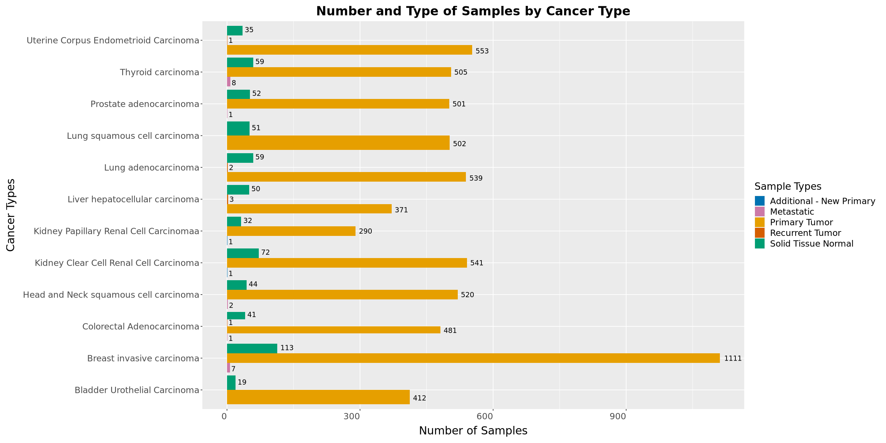
    


```R
# Save the plot as a PNG file
ggsave("figures/samplesTypes_per_cancer.png", plot = p, width = 10, height = 8, dpi = 300)
```


```R
by_tumorVsNormal_n <-colors %>% mutate(by_tumorVsNormal_t = case_when(type == "Solid Tissue Normal" ~  "Normal" ,
                                            .default = "Tumor"))%>% group_by(cancer, by_tumorVsNormal_t) %>% summarise(count = n()) %>% mutate(cancer_full_name = cancer_list_names[cancer])
head(by_tumorVsNormal_n)
```

    `summarise()` has grouped output by 'cancer'. You can override using the `.groups` argument.


<table class="dataframe">
<caption>A grouped_df: 6 × 4</caption>
<thead>
	<tr><th scope=col>cancer</th><th scope=col>by_tumorVsNormal_t</th><th scope=col>count</th><th scope=col>cancer_full_name</th></tr>
	<tr><th scope=col>&lt;fct&gt;</th><th scope=col>&lt;chr&gt;</th><th scope=col>&lt;int&gt;</th><th scope=col>&lt;chr&gt;</th></tr>
</thead>
<tbody>
	<tr><td>TCGA-BLCA</td><td>Normal</td><td>  19</td><td>Bladder Urothelial Carcinoma</td></tr>
	<tr><td>TCGA-BLCA</td><td>Tumor </td><td> 412</td><td>Bladder Urothelial Carcinoma</td></tr>
	<tr><td>TCGA-BRCA</td><td>Normal</td><td> 113</td><td>Breast invasive carcinoma   </td></tr>
	<tr><td>TCGA-BRCA</td><td>Tumor </td><td>1118</td><td>Breast invasive carcinoma   </td></tr>
	<tr><td>TCGA-COAD</td><td>Normal</td><td>  41</td><td>Colorectal Adenocarcinoma   </td></tr>
	<tr><td>TCGA-COAD</td><td>Tumor </td><td> 483</td><td>Colorectal Adenocarcinoma   </td></tr>
</tbody>
</table>


```R
ggplot(by_tumorVsNormal_n, aes(y=cancer_full_name, x=count, fill=by_tumorVsNormal_t)) +
    geom_bar(stat='identity', position='dodge') + 
    geom_text(aes(label=count), 
              position=position_dodge(width=1), 
              hjust=-0.25, vjust=0.5, size=4) +  # Adjust vjust and size as needed 
    scale_fill_manual(values = c("Tumor"='#FF0000',"Normal"='#0000FF')) +
    theme(axis.text.y = element_text(size=14),  # Larger y-axis labels
          axis.text.x = element_text(hjust=1, vjust=0.5, size=14),  # Larger x-axis labels
          axis.title.x = element_text(size=18, margin = margin(t = 10)),  # Larger x-axis title
          axis.title.y = element_text(size=18, margin = margin(r = 10)),  # Larger y-axis title
          plot.title = element_text(size=20, face="bold", hjust = 0.5),  # Larger, centered plot title
          legend.title = element_text(size=16),  # Larger legend title
          legend.text = element_text(size=14),  # Larger legend text
          plot.margin = margin(10, 10, 10, 10)) +
    ggtitle("Number and Type of Samples by Cancer Type: Tumor Vs Normal") +
    labs(fill = "Sample Types", y="Cancer Types", x="Number of Samples")
```


    
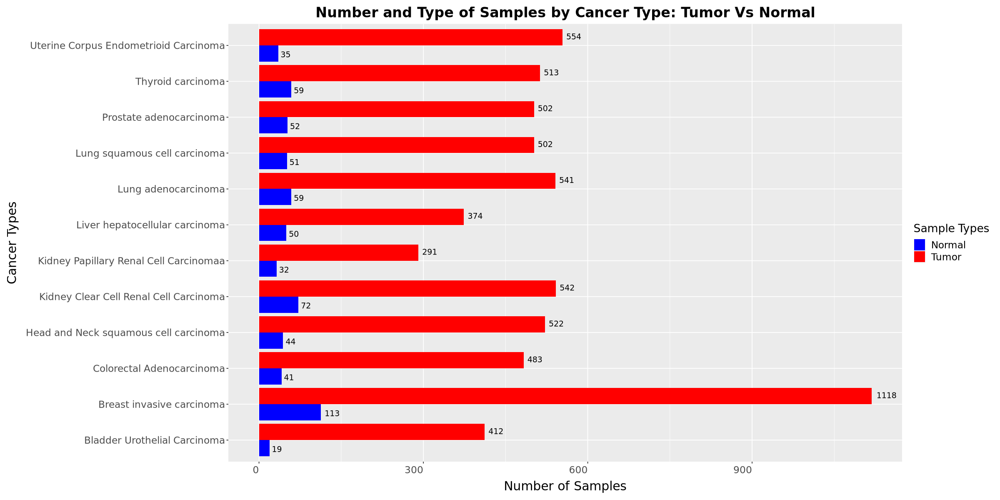
    


#### Some plots for row data 


```R
# Raw counts mean expression Vs standard Deviation (SD)
#plot(rowMeans(as.matrix(merged_countdata[,-1])), rowSds(as.matrix(merged_countdata[,-1])), 
#     main='Raw counts: sd vs mean', 
#     xlim=c(0,10000),
#     ylim=c(0,10000))
```

#### Principal Component Analysis for raw count data


```R
pca <- prcomp(t(merged_countdata[,-1]), scale = F,center = F)
```


```R
pca_data <- as.data.frame(pca$x)
```

**PCA Plots of Samples to Discover Batch Effects**


```R
plot_PCAs(pca_data, colors)
```


    
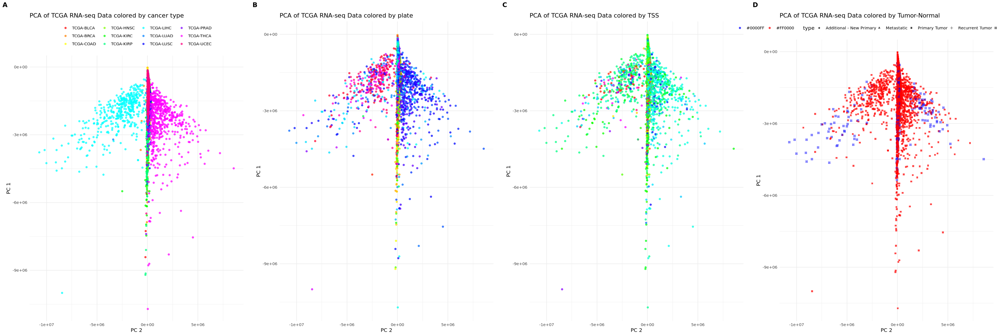
    


Principal Component Analysis (PCA) was performed to detect possible batch effects in the RNA-seq counts for 12 cancer types. The PCA plots are colored by various variables to reveal potential sources of variation:

- **Panel A**: Samples are colored by cancer type. This plot reveals the distribution of samples across different cancer types and highlights clustering based on cancer type.

- **Panel B**: Samples are colored by plate. This panel shows a 'clear' batch effect, with distinct clustering of samples from different plates, indicating potential technical variation related to the processing plates.

- **Panel C**: Samples are colored by Tissue Source Site (TSS). This plot provides insight into how TSS affects sample distribution and helps identify any associated batch effects.

- **Panel D**: Samples are colored by normal versus tumor status. This panel illustrates the separation between normal and tumor samples and helps assess whether batch effects might obscure or mimic biological differences.

A clear batch effect was identified in the plots for cancer type and plate. To address and correct these batch effects, the COMBAT algorithm will be applied. COMBAT is a statistical technique used to adjust for batch effects in high-dimensional data, ensuring that the observed biological variations are not confounded by technical artifacts. This adjustment corrects for batch effects related to both the plate and cancer types, facilitating a more accurate comparison of overall tumor data rather than specific tumor types.


### Remove batch effect using COMBAT:


```R
data4combat<-merged_countdata[,-1]
```


```R
var.data <- apply(data4combat, 1, var)
data4combat_filtered <- data4combat[which(var.data != 0 ),]  # Maria P and Mrin mentioned: We removed entries with zero variance because including them would cause COMBAT to fail.
```

> **Important Note**: The removed information needs to be reconsidered. Removing genes with zero variance before applying COMBAT and then imputing them for Pathway Activity analysis introduces an additional layer of potential inaccuracy. These genes do not vary, and their imputation could misslead the analysis.


```R
head(batchs)
```


<table class="dataframe">
<caption>A data.frame: 6 × 7</caption>
<thead>
	<tr><th></th><th scope=col>project</th><th scope=col>tss</th><th scope=col>participant</th><th scope=col>sampleVial</th><th scope=col>portionAnalyte</th><th scope=col>plate</th><th scope=col>center</th></tr>
	<tr><th></th><th scope=col>&lt;fct&gt;</th><th scope=col>&lt;fct&gt;</th><th scope=col>&lt;fct&gt;</th><th scope=col>&lt;fct&gt;</th><th scope=col>&lt;fct&gt;</th><th scope=col>&lt;fct&gt;</th><th scope=col>&lt;fct&gt;</th></tr>
</thead>
<tbody>
	<tr><th scope=row>1</th><td>TCGA</td><td>CU</td><td>A3KJ</td><td>01A</td><td>11R</td><td>A21D</td><td>07</td></tr>
	<tr><th scope=row>2</th><td>TCGA</td><td>K4</td><td>A3WU</td><td>01B</td><td>11R</td><td>A23N</td><td>07</td></tr>
	<tr><th scope=row>3</th><td>TCGA</td><td>DK</td><td>A3IU</td><td>01A</td><td>11R</td><td>A20F</td><td>07</td></tr>
	<tr><th scope=row>4</th><td>TCGA</td><td>GV</td><td>A40G</td><td>01A</td><td>11R</td><td>A23N</td><td>07</td></tr>
	<tr><th scope=row>5</th><td>TCGA</td><td>DK</td><td>A3IN</td><td>01A</td><td>11R</td><td>A20F</td><td>07</td></tr>
	<tr><th scope=row>6</th><td>TCGA</td><td>SY</td><td>A9G0</td><td>01A</td><td>12R</td><td>A38B</td><td>07</td></tr>
</tbody>
</table>


```R
suppressPackageStartupMessages(library(sva))
my_mod <- model.matrix(~as.factor(plate), data=batchs)
# Apply ComBat
combat <- ComBat(dat = data4combat_filtered, 
                  batch = batchs$plate, 
                  par.prior = TRUE, 
                  prior.plots = FALSE)  # Suppress plotting
```

    Found 33303 genes with uniform expression within a single batch (all zeros); these will not be adjusted for batch.


    Using the 'mean only' version of ComBat
    
    Found178batches
    
    Note: one batch has only one sample, setting mean.only=TRUE
    
    Adjusting for0covariate(s) or covariate level(s)
    
    Standardizing Data across genes
    
    Fitting L/S model and finding priors
    
    Finding parametric adjustments
    
    Adjusting the Data
    
    


```R
pca_unscaled_uncenterd_combat <- prcomp(t(combat), scale = F, center = F)
pca_data_unscaled_uncenterd_combat <- as.data.frame(pca_unscaled_uncenterd_combat$x)
plot_PCAs(pca_data_unscaled_uncenterd_combat, colors)
```


    
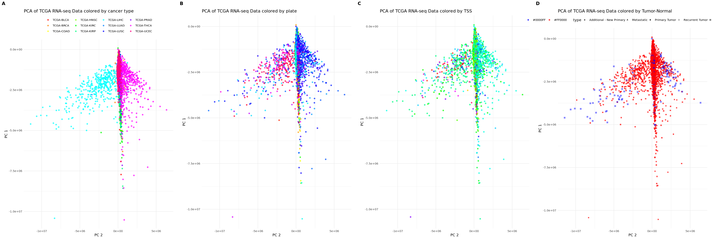
    


> **Important Remark**: Before and after removing batch effects by plate, there is no clear difference observed between the datasets. This step needs to be revisited and redone to ensure proper batch effect correction. Further investigation is required to confirm the effectiveness of the batch effect removal process.


```R
combat2 <- ComBat(dat=combat, batch=batchs$cancer,
                  par.prior = TRUE, 
                  prior.plots = FALSE)  # Suppress plotting
```

    Found 2959 genes with uniform expression within a single batch (all zeros); these will not be adjusted for batch.


    Found12batches
    
    Adjusting for0covariate(s) or covariate level(s)
    
    Standardizing Data across genes
    
    Fitting L/S model and finding priors
    
    Finding parametric adjustments
    
    Adjusting the Data
    
    


```R
pca_unscaled_uncenterd_combat2 <- prcomp(t(combat2), scale = F, center = F)
pca_data_unscaled_uncenterd_combat2 <- as.data.frame(pca_unscaled_uncenterd_combat2$x)
plot_PCAs(pca_data_unscaled_uncenterd_combat2, colors)
```


    
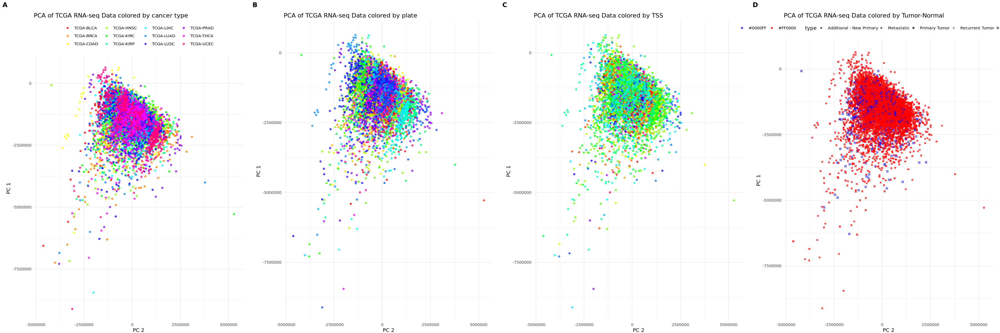
    


> **Important Remark**: The differences between tumor and control classes are not clearly visible after batch effect correction. This raises concerns that we may be losing important biological effects during the batch effect cleaning process. Further review and re-evaluation are needed to ensure that the biological distinctions between tumor and control samples are accurately preserved and not inadvertently masked by the correction process.


### Normalize Data using TMM


```R
my_DGEList <- DGEList(counts=combat2, group = colors$type)
dge <- calcNormFactors(my_DGEList)
logCPM <- cpm(dge, log=TRUE)
```


    Error in DGEList.default(counts = combat2, group = colors$type): Negative counts not allowed
    Traceback:


    1. DGEList(counts = combat2, group = colors$type)

    2. DGEList.default(counts = combat2, group = colors$type)   # at line 1-2 of file /tmp/Rtmp27SShG/R.INSTALL1266ce47ac7a07/edgeR/R/DGEList.R

    3. stop("Negative counts not allowed")   # at line 13 of file /tmp/Rtmp27SShG/R.INSTALL1266ce47ac7a07/edgeR/R/DGEList.R


#### PCAs after normalization


```R
pca_normalized_unscaled_uncenterd <- prcomp(t(logCPM), scale = FALSE, center = FALSE)
pca_data_normalized_unscaled_uncenterd <- as.data.frame(pca_normalized_unscaled_uncenterd$x)
```


```R
pca_normalized_unscaled_centerd <- prcomp(t(logCPM), scale = FALSE, center = TRUE)
pca_data_normalized_unscaled_centerd <- as.data.frame(pca_normalized_unscaled_centerd$x)
```


```R
pca_normalized_scaled_uncenterd <- prcomp(t(logCPM), scale = TRUE, center = FALSE)
pca_data_normalized_scaled_uncenterd <- as.data.frame(pca_normalized_scaled_uncenterd$x)
```


```R
pca_normalized_scaled_centerd <- prcomp(t(logCPM), scale = TRUE, center = TRUE)
pca_data_normalized_scaled_centerd <- as.data.frame(pca_normalized_scaled_centerd$x)
```

###### PCA of row data:


```R
plot_PCAs(pca_data_unscaled_uncenterd_combat2, colors)
```

###### PCA of normalized data, without scaling or centering:


```R
plot_5_PCAs(pca_data_normalized_unscaled_uncenterd, colors)
```

###### PCA of normalized data, without scaling but with centering:


```R
plot_5_PCAs(pca_data_normalized_unscaled_centerd, colors)
```

###### PCA of normalized data, with scaling but without centering:


```R
plot_5_PCAs(pca_data_normalized_scaled_uncenterd, colors)
```

###### PCA of normalized data, with scaling and centering:


```R
plot_5_PCAs(pca_data_normalized_scaled_centerd, colors)
```

### Other plots for tests (to be removed)


```R
res.pca <- PCA(t(merged_countdata[,-1]), graph = FALSE, ncp = 2, scale.unit = F)
```


```R
fviz_pca_ind(res.pca, geom = "point",col.ind = colors$cancer, addEllipses = T)
```


    
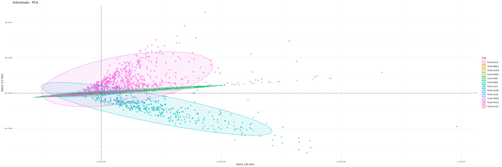
    


```R
fviz_pca_ind(res.pca, geom = "point",col.ind = colors$type)
```


    
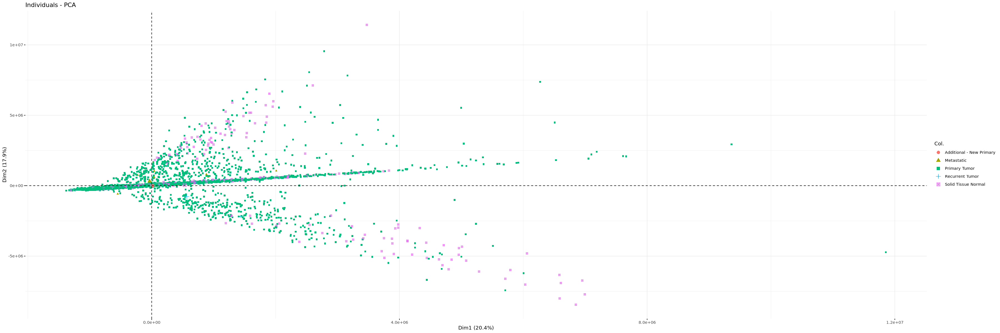
    


```R
mypca = mixOmics::pca(t(merged_countdata[,-1]), ncomp = 2, center = FALSE, scale = FALSE)
```


```R
plot(mypca)
```


    
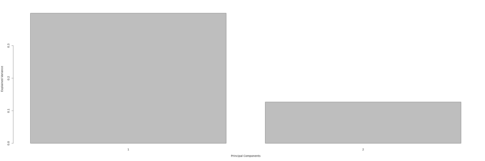
    


```R
p1<-plotIndiv(mypca, comp = 1:2, 
          #ind.names = batchs$participant,
          pch= batchs$group,
          group = colors$cancer,
          # graphical parameters
          col = unique(colors$by_cancer), style = "ggplot2", 
          legend = TRUE, legend.position = "right", 
          legend.title = "Cancer type", ellipse = TRUE, 
          ellipse.level = 0.95, centroid = FALSE)
```


    
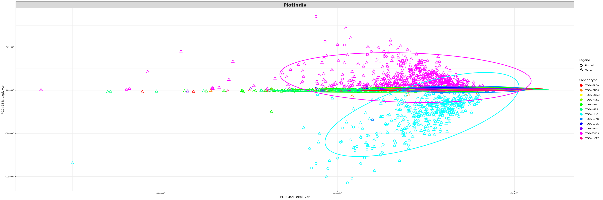
    


```R
p2<-plotIndiv(mypca, comp = 1:2, 
          #ind.names = batchs$participant,
          pch= batchs$group,
          group = batchs$center,
          # graphical parameters
          col = unique(colors$by_center), style = "ggplot2", 
          legend = TRUE, legend.position = "right", 
          legend.title = "Center", ellipse = TRUE, 
          ellipse.level = 0.95, centroid = FALSE)
```


    
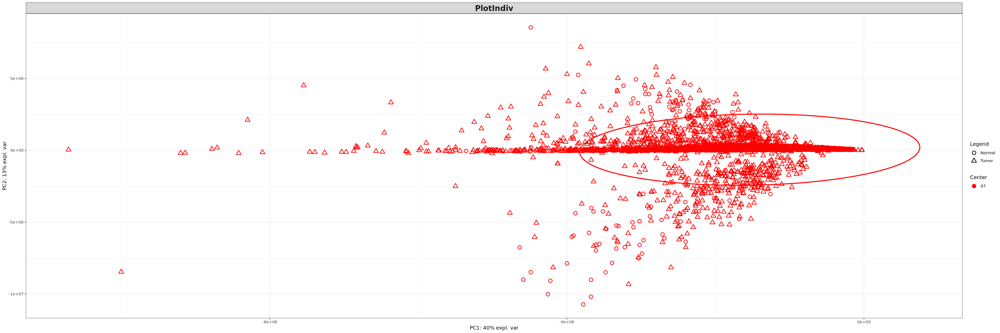
    


```R
p3<-plotIndiv(mypca, comp = 1:2, 
          #ind.names = batchs$participant,
          pch= batchs$group,
          group = batchs$plate,
          # graphical parameters
          #col = unique(colors$by_plate), 
              style = "ggplot2", 
          legend = F, legend.position = "right", 
          legend.title.pch = "Plate", ellipse = F, 
          ellipse.level = 0.95, centroid = FALSE)
```


    

    


```R
p4<-plotIndiv(mypca, comp = 1:2, 
          #ind.names = batchs$participant,
          pch= batchs$group,
          group = batchs$tss,
          # graphical parameters
          col = unique(colors$by_tss), style = "ggplot2", 
          legend = F, legend.position = "right", 
          legend.title = "Center", ellipse = F, 
          ellipse.level = 0.95, centroid = FALSE)
```


    
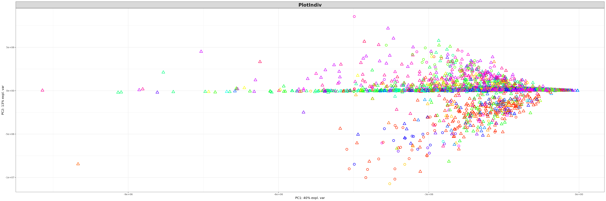
    


```R
p5<-plotIndiv(mypca, comp = 1:2, 
          #ind.names = batchs$participant,
          pch= batchs$group,
          group = colors$type,
          # graphical parameters
          col = unique(colors$by_type), style = "ggplot2", 
          legend = TRUE, legend.position = "right", 
          legend.title = "Center", ellipse = TRUE, 
          ellipse.level = 0.95, centroid = FALSE)
```


    
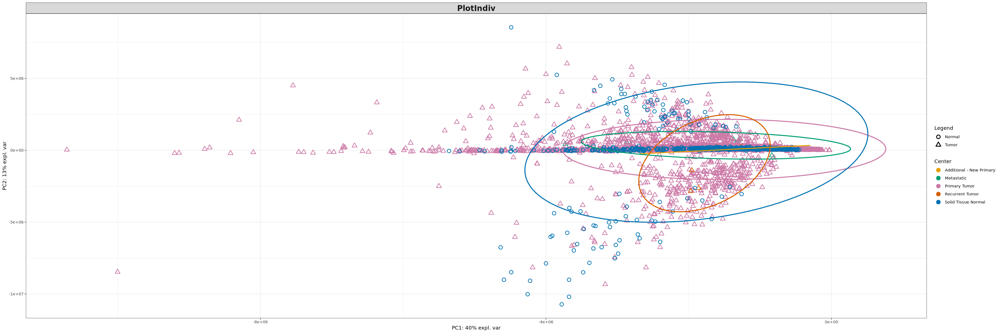
    

